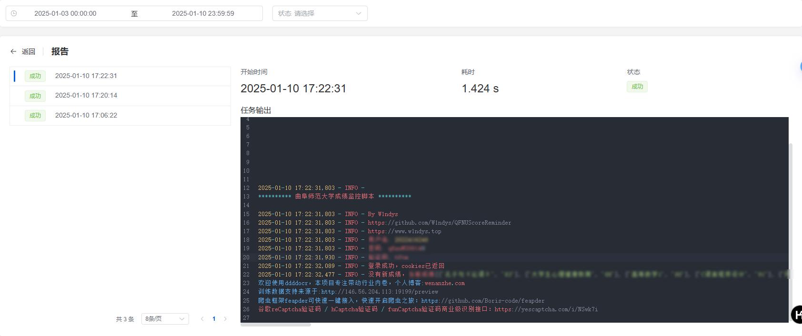

# QFNUScoreReminder

曲阜师范大学教务系统成绩监控，检测到新有成绩出来之后会上报



## 使用方法

1. 安装依赖

```bash
pip install -r requirements.txt
```

2. 运行脚本

```bash
python main.py
```

3. 配置

首次运行时，会自动生成`.env`文件，并保存到当前目录下。

配置文件内容如下：

```
USER_ACCOUNT=教务系统账号
USER_PASSWORD=教务系统密码
DD_BOT_TOKEN=钉钉机器人token
DD_BOT_SECRET=钉钉机器人secret
```

4. 设置定时任务运行脚本即可

```bash
python main.py
```
